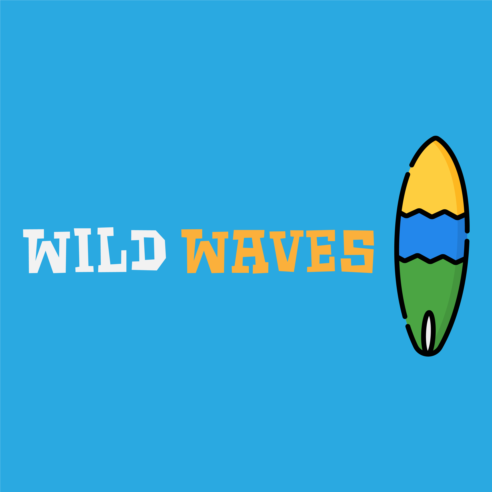

# Wild Waves

[![LinkedIn][linkedin-shield]][linkedin-url]

<!-- PROJECT LOGO -->
 

  

  <h3 align="center">Wild Waves</h3>

  

    A project by Lorenzo Masucci
     
    <a href="https://github.com/masucci/Wild-Waves"><strong>Explore the docs »</strong></a>
     
     
    <a href="https://drive.google.com/file/d/16qVfjCkNWew0xXa8ZZ8xfKwZvnkbBYmr/view?usp=sharing">View Demo</a>
  

<!-- ABOUT THE PROJECT -->
## About The Project

![Product Name Screen Shot][product-screenshot]

This is app is projected to works with iPhone with a native environment. I've used XCode as IDE. 
In the project, all the items are displayed in a TableView. The data are downloaded from a remote JSON. 
The segmented control to select the experience is not still integrated. You can find more info about the spot clicking on it and see the experience needed, the wind in knot and other useful information.
There is also a page where in future will be possible to use the function "Around me" to select the nearest spot.

I also added some features like, Dark mode, little design to improve the UX/UI.

The logo was created with illustrator.

I was careful to write a clean code, refactoring and do some improvements after the first writing. :smile:

### Built With
The project was entirely coded in Swift.
* [Swift](https://swift.org/)
* [UIKit](https://developer.apple.com/documentation/uikit)
* [AVFoundation] (https://developer.apple.com/av-foundation/)
* [JSON File] (https://s3.eu-west-2.amazonaws.com/lpad-public-assets/software-test/all-spots.json)
* [API] (https://api.openweathermap.org)

### Contact me
For more information about me, here you can find some contacts:
* :link: Website: (https://www.lorenzomasucci.fun/)
* :bust_in_silhouette: Linkedin: (https://www.linkedin.com/in/lorenzo-masucci/)
* [:email:  Email](mailto:lorenzo.masucci@outlook.com)

<!-- MARKDOWN LINKS & IMAGES -->
[linkedin-shield]: https://img.shields.io/badge/-LinkedIn-black.svg?style=flat-square&logo=linkedin&colorB=555
[linkedin-url]: https://www.linkedin.com/in/lorenzo-masucci/
[product-screenshot]: images/example.png
